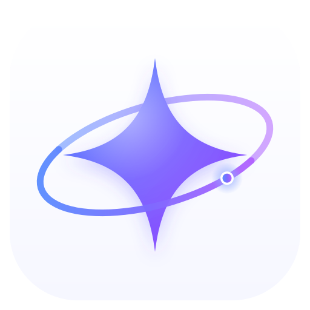

<p align="center">
  
</p>

<h1 align="center">Pivot</h1>

<p align="center">
  <strong>A layered Agent runtime for edge devices, industrial control, and embodied systems.</strong>
</p>

<p align="center">
  Persistent identity · durable stimuli · isolated capabilities · event-driven workers
</p>

<p align="center">
  <a href="https://www.python.org/"></a>
  <a href="pyproject.toml"></a>
  <a href="https://docs.astral.sh/uv/"></a>
  <a href="LICENSE"></a>
</p>

## Origin

A model can reason, but a device Agent must also preserve identity, observe a changing world, coordinate slow work, control hardware, survive restarts, and deliver results across client disconnects. Building all of this around a prompt loop quickly couples model behavior, device code, process lifecycle, and transport logic. pivot provides the runtime layer between them: the framework owns coordination and recovery, while an **instance** owns everything specific to a device or deployment.

## Principles

### Continuity

The main Agent keeps a stable identity and durable history, while every activation runs through a finite model/action loop. Long-lived identity does not require an unbounded task or conversation.

### Boundaries

Device behavior stays in the instance. Short `think`, `measure`, and `work` capabilities run in isolated environments; long-lived hardware connections live in dependency services. The framework remains independent of any sensor, actuator, speech system, or display stack.

### Attention

State can change without invoking a model. Shared event polling, condition waits, and rising/falling-edge bridges let the Agent react only when a change deserves attention. Scoped workers handle long waits and recurring monitoring without blocking the main Agent.

### Recovery

Commands, observations, timers, and worker reports enter one validated stimulus inbox. SQLite preserves Agent state, work, memory, and sequenced outputs, while replay policy distinguishes safe recovery from operations whose side effects may already have occurred.

## Architecture

```text
device adapter / CLI / Python / D-Bus
                  |
                  v
         durable stimulus inbox
                  |
                  v
          persistent main Agent
          /       |        \
         v        v         v
 capabilities  workers   executors
         |        |         |
         +---- instance ----+
                  |
                  v
          durable sequenced output
```

Every external input follows the same path. Before each model call, pivot rebuilds context from scoped tools, recent history, durable memory, and current world state. Workers return results as typed stimuli, keeping the main Agent as the sole external authority. One process exclusively owns an instance and releases dependencies, event polling, SQLite, and the runtime lease in explicit lifecycle order.

## Quickstart

Requirements: Python 3.11+, [uv](https://docs.astral.sh/uv/), and a LiteLLM-supported model.

Install pivot and initialize an instance:

```bash
uv sync
export PIVOT_INSTANCE_PATH=/path/to/your-instance
uv run pivot --no-banner "hello"
```

The first pivot invocation creates the deployment boundary without overwriting existing files:

```text
instance/
├── capabilities/{think,measure,work}/   bounded Agent extensions
├── dependencies/<project>/              long-running device services
├── environment/{think,measure,work,event}/
├── events/                               fields and attention bridges
├── memory/pivot.db                       durable runtime state
├── logs/                                 runtime diagnostics
├── config.toml                           non-secret runtime policy
└── credentials.toml                      named model providers
```

Add a provider to `credentials.toml`, restrict the file, and select it in `config.toml`:

```toml
# credentials.toml
[providers.local]
model = "openai/local-model"
api_base = "http://127.0.0.1:8000/v1"
api_key = "provider-secret"
```

```bash
chmod 600 "$PIVOT_INSTANCE_PATH/credentials.toml"
```

```toml
# config.toml
provider = "local"
```

Start the interactive runtime:

```bash
uv run pivot
```

Add Agent abilities as scripts under `capabilities/think`, `capabilities/measure`, or `capabilities/work`. Every script describes itself with `-l`; think and measure scripts read with `-r`, while work scripts execute with `-x` and receive JSON arguments on stdin. Each kind runs through its matching `environment/<kind>` uv project. See [Capabilities](doc/instance/capabilities.md) for descriptors, result formats, and examples.

Add observable state as scripts under `events/`. An event script lists its fields with `-l` and returns a shared JSON snapshot with `-p`. Agents can wait for level, rising-edge, or falling-edge conditions; persistent bridge rules in `events/bridges.toml` turn meaningful edges into stimuli. See [Events and dependencies](doc/instance/events-and-dependencies.md) for the event and bridge protocols.

The shortest end-to-end guide is [Getting started](doc/instance/getting-started.md); all supported integration contracts are indexed under [Instance development](doc/README.md#instance-development).

For framework development:

```bash
uv sync --group dev
uv run pytest
uv run ruff check src test
uv run ruff format --check src test
```

## Documentation

| Build an instance | Understand the framework |
| --- | --- |
| [Getting started](doc/instance/getting-started.md) | [Architecture](doc/framework/architecture.md) |
| [Configuration](doc/instance/configuration.md) | [Runtime](doc/framework/runtime.md) |
| [Capabilities](doc/instance/capabilities.md) | [Agents](doc/framework/agents.md) |
| [Events and dependencies](doc/instance/events-and-dependencies.md) | [Persistence](doc/framework/persistence.md) |
| [Adapters and deployment](doc/instance/adapters-and-deployment.md) | [Events](doc/framework/events.md) |

The [documentation index](doc/README.md) defines terminology and separates framework invariants from instance protocols.

Licensed under the [MIT License](LICENSE).
